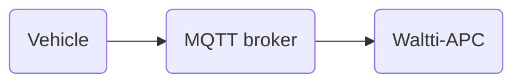

# Waltti-APC Vehicle Specification: Automatic Passenger Counting Data Collection

Waltti Solutions has an IT system called [Waltti-APC](https://github.com/tvv-lippu-ja-maksujarjestelma-oy/waltti-apc) for collecting automatic passenger counting (APC) data from public transit vehicles.
The data is used for public transit planning and also published in a strongly anonymized manner for passenger information services.

This repository contains the technical specifications for data delivery from the vehicles to the Waltti-APC system.
The text is aimed at a technical audience for implementing the systems running in the vehicles, especially the vendors who create and maintain the onboard counting devices.

## Basic principles

The APC devices are expected to count the people and possibly other objects entering and exiting the vehicles.

Each **counting system**, i.e. the set of counting devices installed in one vehicle, is expected to send its results as soon as possible or at each stop.
A counting system could correspond to a set of three cameras in a three-door bus or one security camera sensor in a vehicle.
Usually only one counting system is installed per vehicle.

Experience has shown that attention to detail in the installation of the physical devices improves the quality of the counting results.
It is in the interest of public transport authorities and operators to make sure that the installations are done properly and professionally.

If several messages are sent per stop, Waltti-APC backend will sum the results per stop.
Therefore it is up to the counting system to decide whether to send each passenger individually or to accumulate the results until departing from the stop.

To ease the life of the vendor, there are no requirements in the API regarding the public transit context.
For example, there are no references to routes or stops in the API.

This API has been designed to be compatible with the corresponding [HSL Helsinki Region Transport](https://www.hsl.fi/en) APC API to enable one API specification to serve all of Finland.
If you notice any discrepancies, please contact Waltti.

The delivery from the vehicle must happen over MQTT.
Below are the MQTT and message specifications.



## MQTT message contents

Each message is in JSON.

[apc-from-vehicle.schema.json](./apc-from-vehicle.schema.json) contains the [JSON Schema](https://json-schema.org/) that can validate the data sent to Waltti-APC.
It is required that all counting systems adhere to this schema.

The schema is inspired by an existing API from [HSL Helsinki Region Transport](https://www.hsl.fi/en) and by [ITxPT](https://itxpt.org/).
Read the comments in the schema carefully.

[example-message.json](./example-message.json) contains a JSON example of what could be sent to the MQTT broker:

```json
{
  "APC": {
    "schemaVersion": "1-2-0",
    "countingSystemId": "3298a747-c434-4030-b6d7-ab803bd823d2",
    "messageId": "06e64ba5-e555-4e2f-b8b4-b57bc69e8b99",
    "tst": "2023-09-22T10:57:08.647Z",
    "vehiclecounts": {
      "countquality": "regular",
      "doorcounts": [
        {
          "door": "1",
          "count": [
            {
              "class": "adult",
              "in": 3,
              "out": 0
            }
          ]
        },
        {
          "door": "2",
          "count": [
            {
              "class": "adult",
              "in": 0,
              "out": 2
            },
            {
              "class": "pram",
              "in": 1,
              "out": 0
            }
          ]
        }
      ]
    }
  }
}
```

The values in the messages sent from the vehicle should not be cumulative.
The accumulation is done in the Waltti-APC system.
For example, imagine three adults embark through the first door and a message is sent with value `"in": 3`.
Then two more adults embark on the same stop through the same door and another message is sent.
The latter message should have value `"in": 2`, not `"in": 5`.

Run

```sh
./validate-example-message.sh
```

to validate the preferred example.
You can modify the script for your needs.

Run

```sh
./validate-schema.sh
```

to validate the schema itself.

## MQTT topic

Each counting system has its own topic:

```
apc-from-vehicle/<api-version>/fi/waltti/<vendor-id>/<counting-system-id>
```

Replace `<api-version>` with `v1`.

Replace `<vendor-id>` with your own ID, for example from the Waltti-APC pilot:

- `deal-comp`
- `emblica`
- `telia`

Replace `<counting-system-id>` with the `countingSystemId` described in [apc-from-vehicle.schema.json](./apc-from-vehicle.schema.json).

## Environments and MQTT broker URLs

Each environment has its own MQTT broker to connect to and needs separate credentials.
The credentials are per vendor and per environment.
Make sure you have a way to rotate the credentials in case it is necessary.

Waltti-APC might change the MQTT brokers while retaining the hostname so do not hard code the IP addresses.

### Staging

Initially new vendors and possibly every new counting system will be given access only to the staging environment.

The MQTT broker for the staging environment is at `mqtt-staging.apc.waltti.fi`.

In this environment the data format and the counting system behaviour is checked.

You can both publish and subscribe to your messages in the staging environment.

### Production

Once a counting system has been deemed to function as expected in the staging environment, it can be promoted to production.
In the production environment the counting system results will end up into the hands of the public transit planners and anonymized for public consumption.

The MQTT broker for the production environment is at `mqtt.apc.waltti.fi`.

You can only publish and not subscribe to your messages in the production environment.

## MQTT parameters

### Protocol version

The protocol version used is the [MQTT protocol version 3.1.1 Plus Errata 01](https://docs.oasis-open.org/mqtt/mqtt/v3.1.1/errata01/os/mqtt-v3.1.1-errata01-os-complete.html).
Any updates to the protocol version will be communicated clearly.

### Port

Use port `8883` with TLS.

### Authentication

Authenticate with a username and a password.

### Authorization

You will be allowed to act within the topic tree:

```
apc-from-vehicle/v1/fi/waltti/<vendor-id>/#
```

where `<vendor-id>` is described in the section MQTT topic.

### Reconnecting

Reconnect automatically.

This is usually handled by the MQTT client library in the client configuration or in the `connectionLostCallback()` or equivalent.

### QoS

Use QoS 1.

This is usually defined in the arguments for `publish()` or equivalent of the MQTT client library.

### Retained messages

Do not use retained messages.

This is usually defined in the arguments for `publish()` or equivalent of the MQTT client library.

### Clean session

Set clean session to false, i.e. do not wipe out in-progress message acknowledgments upon reconnecting.

This is usually defined in the arguments for `connect()` or equivalent of the MQTT client library.

### Client Identifier

The Client Identifier (ClientId) names the MQTT session that persists over several TCP connections when "clean session" is set to false.
For example MQTT message acknowledgment is based on ClientId.

Unfortunately the MQTT protocol version 3.1.1 has a protocol bug enabling a denial-of-service attack on connected clients:
**If any two clients, no matter their credentials, successfully connect with the same ClientId, the broker must disconnect the first connection.**
MQTT protocol version 5.0 solves this bug but Waltti-APC does not support it, yet.

It is not planned but maybe at some point the MQTT brokers will be consolidated into one and used by consumer-facing services in the future.
At that point no one wants to handle ClientId conflicts.
Therefore the ClientId must be protected from the start.

For each MQTT client/vehicle use a ClientId of the form:

```
<vendor-id>-<random-suffix>
```

where `<vendor-id>` is described in the section MQTT topic and `<random-suffix>` is 10 characters from the range `[0-9A-Za-z]` randomly generated by you for each counting system.

Normally there is no need to change `<random-suffix>`.
Do not change `<random-suffix>` unless you are sure all messages from the counting system have been delivered and every message has been fully acknowledged.

Treat `<random-suffix>` as a sensitive secret like a password.

### Last Will scheme

Using Last Will is an easy and cheap investment into your connection debugging pleasures.

Use a connection status topic:

```
apc-from-vehicle/<api-version>/fi/waltti/<vendor-id>/<counting-system-id>/connection-status
```

The section on the MQTT topic explains the topic variables.

When connecting to the broker with the MQTT `CONNECT` message, specify a Last Will UTF-8 message payload `disconnected` into the connection status topic.

Ask broker to send the Last Will as a retained message with QoS 2.

These are usually defined in the arguments for `connect()` or equivalent of the MQTT client library.

When connecting or reconnecting, first send a UTF-8 message `connected at <connected-time>` to the connection status topic.
`<connected-time>` should be created as early as possible when the MQTT (re)connection succeeds.
It must contain an ISO 8601 timestamp with a fixed precision, for example millisecond precision, and with UTC time zone denoted with `Z`, e.g. `2023-09-27T08:29:28.123Z`.

This message should be sent as a retained message with QoS 2, too.

This is usually handled in the `connectionSucceededCallback()` or equivalent of the MQTT client library.

### Buffering

To avoid data loss due to power outages or connection problems, it is recommended to persist messages on non-volatile storage until acknowledged by the MQTT broker.

You could for example retain all messages in a deque or ring buffer that can contain messages for a week.
Another data structure may be used instead as long as the oldest messages are thrown away first if a size limit is reached.

MQTT client libraries will not usually do this for you but will offer the necessary callbacks.
